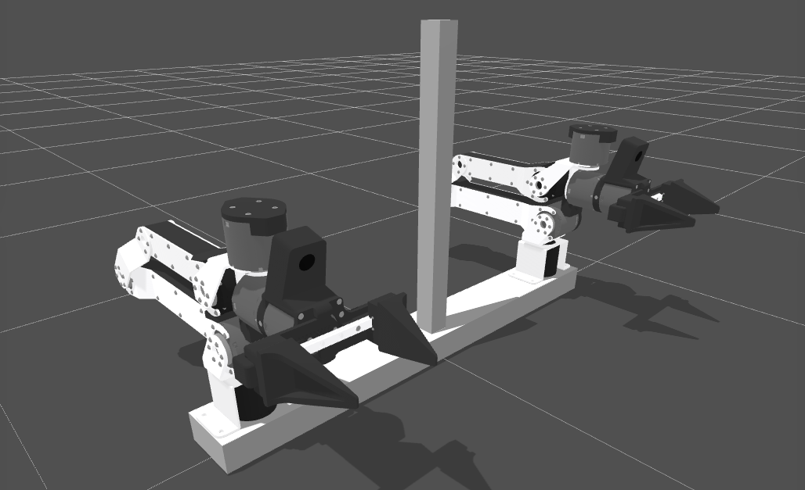

# DK1 Dual-Arm URDF

URDF description of the [DK1-X: Tabletop Bimanual Configuration](https://docs.robot-learning.co/hardware/configurations).

## Structure

- `dk1_dual_arm.urdf` — Full robot description including mounting frame, two follower arms, and overhead camera
- `meshes/visual/` — Visual meshes (`.glb`)
- `meshes/collision/` — Collision meshes (`.stl`)

## Coordinate Frame

- **X+** → Right (operator's perspective)
- **Y+** → Forward (into the workspace)
- **Z+** → Up

Origin is at the center of the front aluminum crossbar at table height.

## Layout

Two identical TRLC-DK1 follower arms are mounted symmetrically on a 700 mm aluminum crossbar, 580 mm apart (center-to-center). An overhead camera is mounted on a vertical mast at the front-center, tilted 45° downward toward the workspace.
